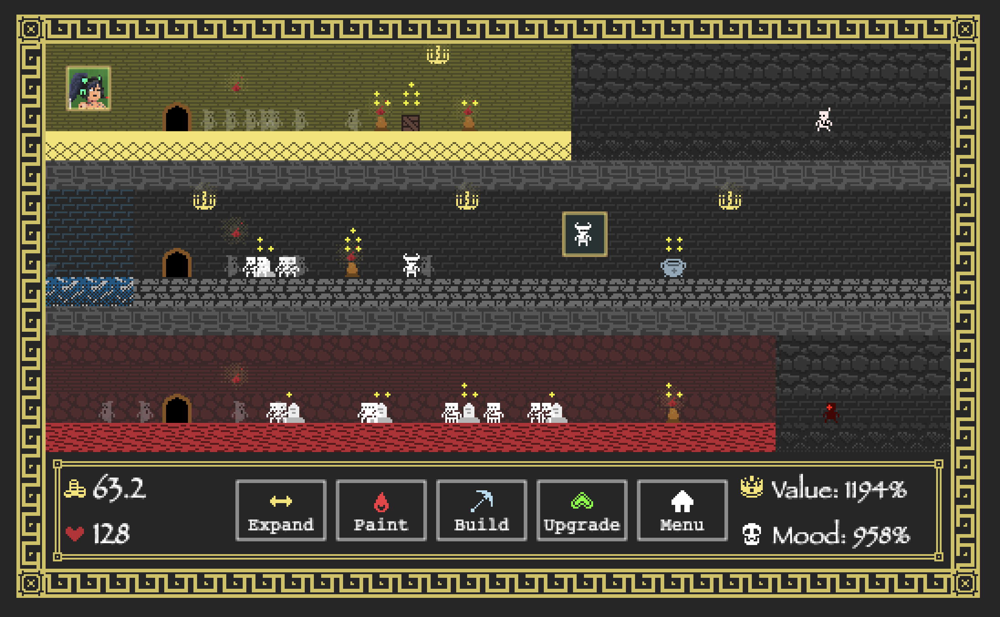

# Hades Defence

Entry for JS13k 2022 contest. Theme: **Death** 

[Play online](https://vilpy.github.io/hades-defence/)

You are Hades - greek god of the dead and the king of the underworld. 
Your duty is to build underworld defence to protect yourself from enemies. 
Monsters of the underworld and pesky bandits will try to tackle you. 
Don't be fooled by first waves. Pressure will only increase over time.

Create barricades to block their way, build magic altars which will burn them down, and spawn skeletons who will protect you. Those building can be upgraded to improve their stats.

You are also not worthless and able to throw fireballs.

While not in battle, you would also need to tidy and expand your underworld in order to get more money from arriving souls and boost your mood.
Charon will lead them in his fancy boat.

Adding value to the underworld will increase the money flow, while improving the mood will make you more powerful. 
But be aware that everyone likes personal space, so each arrived soul will increase the hustle and decrease your stats a bit.

## Gameplay
- Character can be controlled with arrow keys. Use mouse for interaction. 
- 👑 Value stat increases the amount of arriving souls and hence money inflow.
- 💀 Mood stat improves character attack speed and damage
- Both stats are slightly reduced when additional souls arrive

## Near Wallet Integration
You can connect with your **testnet** Near (https://near.org/) wallet in order to buy **_💸✨premium tier✨💸_** and receive more money at the beginning of each new game. This would also unlock fancy rainbow wall and floor tiles.

You can also try to play on other players maps simply by using their Near wallet id since all data is visible in blockchain. Changes in this case won't be saved into other players state and will be available only for you. 

## Arcadians NFT
Arcadians avatars from https://arcadians.io/ can be used to improve aesthetics of your underworld. Simply pick it in build menu, enter ID and enjoy a new painting. Those would be cropped to include only the head tho.

## License
- Code: GPLv3
- Gfx assets: CC BY 4.0

## Credits
- Characters: https://opengameart.org/content/bw-surreal-office-rpg-1-bit-sprites-and-tiles (CC BY 4.0)
  - Sdivi Lee Hall @anactualpokemon
- Items and icons: https://kenney.nl/assets/bit-pack (CC0 1.0)
